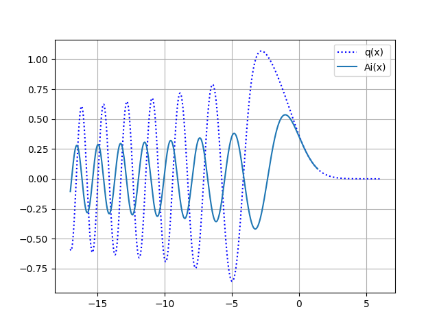

# Propriétés spectrales des matrices aléatoires
## Distribution des valeurs propres maximales

On considère un ensemble gaussien de valeur $\beta$ donnée ($\beta =1$ pour l'ensemble orthogonal (GOE), $\beta=2$ pour l'ensemble unitaire (GUE) et $\beta=4$ pour l'ensemble symplectique (GSE)) constitué de matrices $M$ (symétriques, hermitiennes, quaternioniques respectivement) de taille nxn avec les éléments diagonaux centrés de variance 1 et les éléments non diagonaux centrés de variance $\sigma^2$. 
 
Soit $\lambda_{max}$ une variable aléatoire correspondant à la plus grande valeur propre de la matrice $M$. 
La suite $`\left(X_n \right)_{n \geq 0}`$ de variables aléatoires $$X_n:=\left( \frac{\lambda_{max}}{\sigma} - 2\sqrt{n} \right)n^{1/6}$$
converge en loi vers la distribution dite de Tracy-Widom notée $f_{\beta}$ de fonction de partition $`F_{\beta}`$ ($`F'_\beta = f_\beta`$):
```math
\lim_{n\rightarrow +\infty} \mathbb{P}\left(X_n \leq s \right) = F_{\beta}(s)
```
donnée par:
```math
F_2(s) = \exp \left(-\int_s^{+\infty} (x-s)q^2(x) dx \right)
```
```math
F_1(s) = \sqrt{F_2(s)} \exp \left( -\frac{1}{2} \int_s^{+\infty} q(x) dx \right)
```
```math
F_4(s) = \sqrt{F_2(s)} \cosh \left( \frac{1}{2} \int_s^{+\infty} q(x) dx \right)
```
où $`q(x)`$ est la solution de l'équation de Painlevé II:
```math
q''(x) = x q(x) + 2q(x)^3
```
avec la condition asymptotique $`\lim_{x \to +\infty} q(x) = Ai(x)`$ (fonction d'Airy). 

Le programme effectue $N$ tirages de matrices de taille nxn de l'ensemble GUE  avec l'écart-type unitaire: $\sigma=1$.
Il construit un histogramme des plus grandes valeurs propres préalablement recentrées et mises à l'échelle : 
$`\lambda_{max} \leftarrow \left( \lambda_{max}- 2\sqrt{n} \right)n^{1/6}`$. 
On compare le résultat avec la loi de Tracy-Widom $`f_2(s)`$ trouvée en résolvant l'équation de Painlevé II (avec la méthode *scipy.integrate.solve_ivp*).




Remarque: Une variable aléatoire complexe de variance $\sigma^2$ est composée de parties réelle et imaginaire qui ont chacune une variance $\frac{\sigma^2}{2}$. Ainsi, pour générer un nombre complexe $z$ selon la loi gaussienne centrée en 0 et de variance 1 on écrira z=np.random.normal(0,1/np.sqrt(2.))+1j*np.random.normal(0,1/np.sqrt(2.)), le deuxième argument de numpy.random.normal correspondant à l'écart type $\sigma$.
